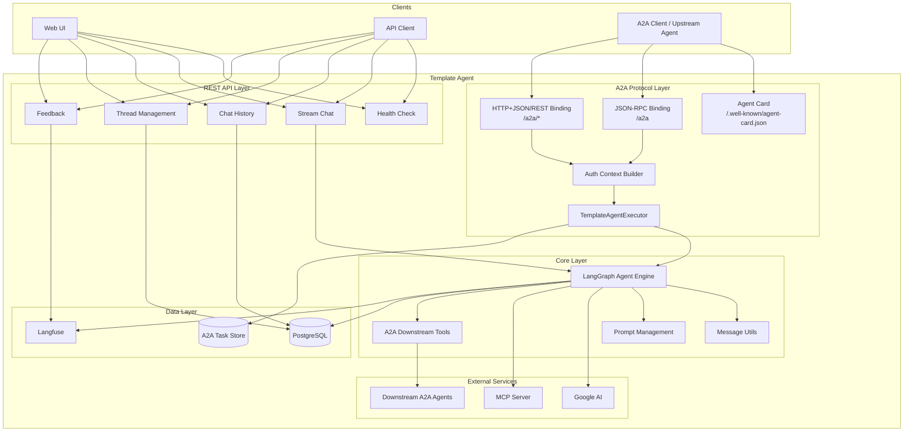

# Template Agent

[](https://www.python.org/downloads/)
[](https://github.com/redhat-data-and-ai/template-mcp-server/actions/workflows/ci.yml)
[](https://codecov.io/gh/redhat-data-and-ai/template-mcp-server)
[](https://opensource.org/licenses/Apache-2.0)

A production-ready template for building AI agents with streaming capabilities, conversation management, and enterprise-grade features.

## 🌟 Features

- **Simplified Streaming API**: Clean, consistent event format for easy client integration
- **Real-time Streaming**: Server-Sent Events (SSE) with token and message streaming
- **Multiple Client Examples**: TypeScript, Python async, and Streamlit demo applications
- **Conversation Management**: Multi-turn conversations with thread persistence
- **Enterprise Integration**: Langfuse tracing, PostgreSQL checkpointing, SSO support
- **Modular Architecture**: AgentManager abstraction with clean separation of concerns
- **Production Ready**: Health checks, error handling, and comprehensive logging
- **Google AI Integration**: Built-in support for Google Generative AI models
- **Agent2Agent (A2A) v1.0**: Spec-compliant A2A protocol with JSON-RPC, HTTP+JSON/REST bindings, streaming, and dynamic downstream agent discovery

## 🏗️ Architecture



## 📡 Simplified Streaming API

The Template Agent now features a simplified streaming API that makes client integration easier while preserving all enterprise features:

### Single Streaming Endpoint

```http
POST /v1/stream
Content-Type: application/json
Accept: text/event-stream
```

### Request Format

```json
{
  "message": "User input message",
  "thread_id": "conversation-thread-id",
  "session_id": "session-id",
  "user_id": "user-identifier",
  "stream_tokens": true
}
```

### Response Format

```json
{"type": "message", "content": {"type": "ai", "content": "", "tool_calls": [...]}}
{"type": "token", "content": "Hello"}
{"type": "token", "content": " world"}
{"type": "message", "content": {"type": "ai", "content": "Hello world"}}
[DONE]
```

### Client Examples

Ready-to-use client examples are available in the [`examples/`](./examples/) directory:

- **[Streamlit Demo App](./examples/streamlit_app.py)** - Interactive chat application
- **[Python Async Client](./examples/client_python.py)** - Server-to-server integration

See the [examples README](./examples/README.md) for detailed usage instructions.

## Agent2Agent (A2A) Protocol

This agent implements the [Agent2Agent (A2A) Protocol v1.0](https://a2a-protocol.org/latest/specification/) using the [`a2a-sdk`](https://pypi.org/project/a2a-sdk/) Python SDK. A2A is an open protocol that enables agents to discover each other's capabilities, negotiate interaction modalities, manage collaborative tasks, and securely exchange information -- all without sharing internal state, memory, or tools (Spec Section 1).

### Spec Compliance Summary

| Spec Requirement | Implementation |
|---|---|
| **Agent Card** (Section 8) | Published at `/.well-known/agent-card.json` (unauthenticated) |
| **JSON-RPC Binding** (Section 9) | `POST /a2a` with v0.3 backward compatibility |
| **HTTP+JSON/REST Binding** (Section 11) | `POST /a2a/message:send`, `/a2a/message:stream`, `/a2a/tasks`, etc. |
| **Streaming** (Section 3.5) | SSE-based streaming via `SendStreamingMessage` |
| **Task Lifecycle** (Section 3) | Full task state machine: submitted → working → completed/failed/canceled |
| **Multi-Turn Conversations** (Section 3.4) | Context ID propagation across turns and downstream agents |
| **Security** (Section 7) | Bearer token (JWT/JWE) authentication on all operational endpoints |
| **Agent Discovery** (Section 8.2) | Well-Known URI, interface preference ordering, skill declarations |
| **Persistence** | PostgreSQL `DatabaseTaskStore` (production) or `InMemoryTaskStore` (dev) |

### Agent Card

The Agent Card (Spec Section 4.4.1 / Section 8) describes the agent's identity, capabilities, skills, protocol interfaces, and security requirements. It is served at the well-known URI per the spec:

```
GET /.well-known/agent-card.json
```

The card advertises:

- **Three protocol interfaces** in preference order (Spec Section 8.3.1):
  1. JSON-RPC v1.0 at `/a2a` (preferred)
  2. JSON-RPC v0.3 at `/a2a` (backward compatibility)
  3. HTTP+JSON/REST v1.0 at `/a2a`
- **Capabilities**: `streaming: true`
- **Skills**: `general-assistant` -- general-purpose AI assistant with MCP tool access
- **Security**: Bearer token (JWT format) required on all operational endpoints
- **I/O modes**: Input `text/plain`; Output `text/plain`, `application/json`

### Protocol Bindings

The A2A spec defines abstract operations (Section 3) mapped to concrete protocol bindings (Section 5). This agent supports two bindings:

**JSON-RPC Binding** (Spec Section 9) at `POST /a2a`:

| JSON-RPC Method | Spec Section | Description |
|---|---|---|
| `message/send` | 9.4.1 | Send a message and receive a Task |
| `message/stream` | 9.4.2 | Send a message and stream Task updates via SSE |
| `tasks/get` | 9.4.3 | Retrieve a task by ID |
| `tasks/list` | 9.4.4 | List tasks, optionally filtered by context |
| `tasks/cancel` | 9.4.5 | Cancel an in-progress task |

**HTTP+JSON/REST Binding** (Spec Section 11) under `/a2a`:

| REST Endpoint | Method | Spec Section | Description |
|---|---|---|---|
| `/a2a/message:send` | POST | 11.3.1 | Send a message |
| `/a2a/message:stream` | POST | 11.3.2 | Stream task updates |
| `/a2a/tasks` | GET | 11.3.3 | List tasks |
| `/a2a/tasks/{id}` | GET | 11.3.3 | Get a specific task |
| `/a2a/tasks/{id}:cancel` | POST | 11.3.3 | Cancel a task |

### Authentication & Security

Authentication follows the A2A spec Section 7. The Agent Card declares a `bearer` security scheme (HTTPAuth with JWT format) in `securitySchemes`, and lists it in `securityRequirements`.

The `A2AServerCallContextBuilder` handles all incoming A2A requests:

1. Extracts the `Authorization: Bearer <token>` header
2. Detects token format: **JWT** (3 dot-separated segments) or **JWE** (5 segments)
3. For JWT: decodes claims (without signature verification) to extract identity (`preferred_username` / `sub` / `email`)
4. For JWE: accepts as-is for downstream forwarding (the agent cannot decrypt it)
5. Stores the raw token in `ServerCallContext.state` for credential forwarding

The `/.well-known/agent-card.json` endpoint is **not** routed through authentication, per the spec requirement that Agent Card discovery remain public (Section 8).

### Downstream Agent Delegation

The agent can orchestrate downstream A2A agents using the spec's discovery and messaging mechanisms:

1. **Discovery** (Spec Section 8.2): On startup, the agent fetches Agent Cards from URLs configured in `A2A_DOWNSTREAM_AGENT_URLS` using `A2ACardResolver`
2. **Tool Creation**: Each skill declared in a downstream Agent Card becomes a LangChain `StructuredTool` available to the LangGraph agent
3. **Credential Forwarding** (Spec Section 7): The caller's bearer token is forwarded to downstream agents via `ForwardingCredentialService` + `AuthInterceptor`
4. **Agent Identification** (Spec Section 3.2.6): Outbound requests include an `X-Calling-Agent-ID` service parameter via `CallingAgentInterceptor`
5. **Context Propagation** (Spec Section 3.4.1): The `context_id` is passed through to downstream calls for multi-turn conversation continuity

### Deployment Modes

| Mode | Condition | Behavior |
|---|---|---|
| **Standalone** | `A2A_DOWNSTREAM_AGENT_URLS` unset | MCP tools only, no downstream delegation |
| **Orchestrator** | `A2A_DOWNSTREAM_AGENT_URLS` set | MCP tools + dynamically discovered A2A agent tools |
| **Leaf** | No special config needed | Any upstream agent discovers this agent's card and calls it |

### A2A Configuration Reference

| Variable | Default | Description |
|---|---|---|
| `A2A_ENABLED` | `true` | Mount the A2A Starlette sub-app |
| `A2A_AGENT_NAME` | `Template Agent` | Agent name in the Agent Card |
| `A2A_AGENT_DESCRIPTION` | `A template AI agent with tool capabilities via MCP` | Agent description |
| `A2A_AGENT_VERSION` | `1.0.0` | Version advertised in the Agent Card |
| `A2A_PROVIDER_ORG` | *(empty)* | Provider organization (omitted from card if blank) |
| `A2A_PROVIDER_URL` | *(empty)* | Provider URL (omitted from card if blank) |
| `A2A_DOWNSTREAM_AGENT_URLS` | *(unset)* | Comma-separated base URLs of downstream A2A agents |

### Configuration Examples

**Standalone** (MCP tools only):
```bash
A2A_ENABLED=true
A2A_AGENT_NAME="Template Agent"
```

**Orchestrator** (delegates to downstream A2A agents):
```bash
A2A_ENABLED=true
A2A_AGENT_NAME="Orchestrator Agent"
A2A_DOWNSTREAM_AGENT_URLS="http://data-agent:8082,http://search-agent:8083"
```

**Leaf agent** (called by upstream agents):
```bash
A2A_ENABLED=true
A2A_AGENT_NAME="Data Agent"
# No downstream config needed; upstream agents discover this agent's card
```

### Task Lifecycle

Tasks follow the A2A state machine (Spec Section 4.1.3):

```
submitted → working → completed
                   → failed
                   → canceled (via tasks/cancel)
```

The `TemplateAgentExecutor` bridges A2A requests to the LangGraph agent:
1. Receives a `RequestContext` from the SDK's `DefaultRequestHandler`
2. Creates or resumes a `Task` with status tracking via `TaskUpdater`
3. Streams LLM token chunks as `Artifact` updates
4. Handles cancellation by cancelling the underlying `asyncio.Task`

Task persistence uses `DatabaseTaskStore` (PostgreSQL via SQLAlchemy async engine) in production and `InMemoryTaskStore` in development (`USE_INMEMORY_SAVER=true`).

### TCK & Inspector Validation

Use the [A2A Inspector](https://github.com/a2aproject/a2a-inspector) during development and the [A2A TCK](https://github.com/a2aproject/a2a-tck) in CI:

```bash
# Verify agent card, security schemes, and message exchange
# Connect Inspector to http://localhost:8081

# Mandatory compliance
./run_tck.py --sut-url http://localhost:8081/a2a --category mandatory

# Capability validation
./run_tck.py --sut-url http://localhost:8081/a2a --category capabilities

# Full compliance report
./run_tck.py --sut-url http://localhost:8081/a2a --category all --compliance-report report.json
```

## 🚀 Quick Start

### Prerequisites

- Python 3.12+
- PostgreSQL database
- Google AI API credentials
- Langfuse account (optional)

### Installation

1. **Clone the repository**
   ```bash
   git clone https://github.com/redhat-data-and-ai/template-agent.git
   cd template-agent
   ```

2. **Create virtual environment**
   ```bash
   uv venv
   source .venv/bin/activate

   ```

3. **Install dependencies**
   ```bash
   uv pip install -e ".[dev]"
   ```

4. **Set up environment variables**
   ```bash
   cp .env.example .env
   # Edit .env with your configuration
   ```

5. **Run template-mcp-server** following https://github.com/redhat-data-and-ai/template-mcp-server


6. **Run the application**
   ```bash
   uv run python -m template_agent.src.main
   ```


## 📚 API Reference

### Endpoints

| Endpoint | Method | Auth | Description |
|---|---|---|---|
| `/health` | GET | No | Health check |
| `/v1/stream` | POST | SSO | Stream chat responses |
| `/v1/history/{thread_id}` | GET | SSO | Get conversation history |
| `/v1/threads/{user_id}` | GET | SSO | List user threads |
| `/v1/feedback` | POST | SSO | Record feedback |
| `/.well-known/agent-card.json` | GET | No | A2A Agent Card discovery |
| `/a2a` | POST | Bearer | A2A JSON-RPC endpoint |
| `/a2a/message:send` | POST | Bearer | A2A REST send message |
| `/a2a/message:stream` | POST | Bearer | A2A REST stream message |
| `/a2a/tasks` | GET | Bearer | A2A REST list tasks |
| `/a2a/tasks/{id}` | GET | Bearer | A2A REST get task |
| `/a2a/tasks/{id}:cancel` | POST | Bearer | A2A REST cancel task |

### Streaming Chat

```bash
curl -X POST "http://localhost:8081/v1/stream" \
  -H "Content-Type: application/json" \
  -d '{
    "message": "Hello, how can you help me?",
    "thread_id": "thread_123",
    "user_id": "user_456",
    "stream_tokens": true
  }'
```

### Health Check

```bash
curl "http://localhost:8081/health"
# Response: {"status": "healthy", "service": "Template Agent"}
```

## ⚙️ Configuration

### Environment Variables

#### Required
- `AGENT_HOST`: Server host (default: 0.0.0.0)
- `AGENT_PORT`: Server port (default: 5002)
- `PYTHON_LOG_LEVEL`: Logging level (default: INFO)

#### Database
- `POSTGRES_USER`: Database username (default: pgvector)
- `POSTGRES_PASSWORD`: Database password (default: pgvector)
- `POSTGRES_DB`: Database name (default: pgvector)
- `POSTGRES_HOST`: Database host (default: pgvector)
- `POSTGRES_PORT`: Database port (default: 5432)

#### Optional
- `LANGFUSE_PUBLIC_KEY`: Langfuse public key for tracing
- `LANGFUSE_SECRET_KEY`: Langfuse secret key for tracing
- `LANGFUSE_BASE_URL`: Langfuse host URL (e.g., https://cloud.langfuse.com)
- `LANGFUSE_TRACING_ENVIRONMENT`: Langfuse environment (default: development)
- `GOOGLE_SERVICE_ACCOUNT_FILE`: Google credentials
- `AGENT_SSL_KEYFILE`: SSL private key path
- `AGENT_SSL_CERTFILE`: SSL certificate path

### Configuration Example

```bash
# .env file
AGENT_HOST=0.0.0.0
AGENT_PORT=5002
PYTHON_LOG_LEVEL=INFO

POSTGRES_USER=myuser
POSTGRES_PASSWORD=mypassword
POSTGRES_DB=template_agent
POSTGRES_HOST=localhost
POSTGRES_PORT=5432

LANGFUSE_TRACING_ENVIRONMENT=production
GOOGLE_SERVICE_ACCOUNT_FILE=/path/to/credentials.json
```

## 🧪 Testing

### Run Tests

```bash
# Run all tests
pytest

# Run with coverage
pytest --cov=template_agent.src --cov-report=html

# Run specific test file
pytest tests/test_prompt.py -v
```

### Test Coverage

Current test coverage includes:
- ✅ Core utilities (prompt, agent_utils)
- ✅ Data models (schema)
- ✅ Configuration (settings, A2A settings & properties)
- ✅ API endpoints (health, feedback, routes)
- ✅ A2A Agent Card builder
- ✅ A2A auth context builder (JWT/JWE, bearer extraction, username fallback)
- ✅ A2A executor (output modes, task lifecycle, cancel, error handling)
- ✅ A2A client (credential forwarding, interceptors, downstream messaging)
- ✅ A2A tools (discovery, tool creation, name sanitization, context propagation)

## 🚀 Deployment

### Podman Compose

```bash
# Start with Docker Compose
podman-compose up -d --build
```

### Production Considerations

- **SSL/TLS**: Configure SSL certificates for HTTPS
- **Database**: Use managed PostgreSQL service
- **Monitoring**: Set up Langfuse for tracing
- **Scaling**: Configure horizontal pod autoscaling
- **Security**: Implement proper authentication

## 🔧 Development

### Project Structure

```
template-agent/
├── template_agent/
│   └── src/
│       ├── a2a/               # A2A protocol integration (a2a-sdk)
│       │   ├── agent_card.py  # Agent Card builder
│       │   ├── auth.py        # Bearer token auth & context builder
│       │   ├── executor.py    # AgentExecutor bridging A2A → LangGraph
│       │   ├── client.py      # Downstream A2A client & credential forwarding
│       │   └── tools.py       # Dynamic LangChain tools from Agent Cards
│       ├── core/              # Core agent functionality
│       │   ├── agent.py       # LangGraph agent initialization
│       │   ├── manager.py     # AgentManager for REST streaming
│       │   ├── agent_utils.py # Message utilities
│       │   └── prompt.py      # Prompt management
│       ├── routes/            # REST API endpoints
│       │   ├── health.py      # Health checks
│       │   ├── stream.py      # Streaming chat
│       │   ├── history.py     # Chat history
│       │   ├── threads.py     # Thread management
│       │   └── feedback.py    # Feedback recording
│       ├── api.py             # FastAPI app + A2A Starlette sub-app mount
│       ├── main.py            # Application entry point
│       ├── schema.py          # Data models
│       └── settings.py        # Configuration (incl. A2A settings)
├── tests/                     # Test suite (incl. A2A unit tests)
└── README.md
```

### Code Quality

```bash
# Run linting
ruff check .

# Run type checking
mypy template_agent/src/

# Run formatting
ruff format .

# Run pre-commit hooks
pre-commit run --all-files
```

### Adding New Features

1. **Create feature branch**
   ```bash
   git checkout -b feature/new-feature
   ```

2. **Implement changes**
   - Follow Google docstring format
   - Add type hints
   - Write tests for new functionality

3. **Run quality checks**
   ```bash
   pre-commit run --all-files
   pytest
   ```

4. **Submit pull request**
   - Include tests
   - Update documentation
   - Follow commit message conventions

### Development Setup

1. Fork the repository
2. Create a feature branch
3. Make your changes
4. Add tests for new functionality
5. Ensure all tests pass
6. Submit a pull request

### Code Standards

- **Python**: Follow PEP 8 and use type hints
- **Documentation**: Use Google docstring format
- **Tests**: Maintain >80% code coverage
- **Commits**: Use conventional commit messages

This template includes `.cursor/rules.md` - a comprehensive development guide specifically designed to help AI coding assistants understand and work effectively with this MCP server template.

### What's Included

## 🆘 Support

- **Issues**: [GitHub Issues](https://github.com/redhat-data-and-ai/template-agent/issues)

## 🔗 Related Projects

- [A2A Protocol](https://a2a-protocol.org/) - Agent2Agent open protocol specification
- [a2a-sdk](https://pypi.org/project/a2a-sdk/) - Official A2A Python SDK
- [A2A Samples](https://github.com/a2aproject/a2a-samples) - A2A protocol sample implementations
- [LangChain](https://github.com/langchain-ai/langchain) - LLM application framework
- [LangGraph](https://github.com/langchain-ai/langgraph) - Stateful LLM applications
- [FastAPI](https://fastapi.tiangolo.com/) - Modern web framework
- [Langfuse](https://langfuse.com/) - LLM observability platform

---

**Built with ❤️ by the Red Hat Data & AI team**
